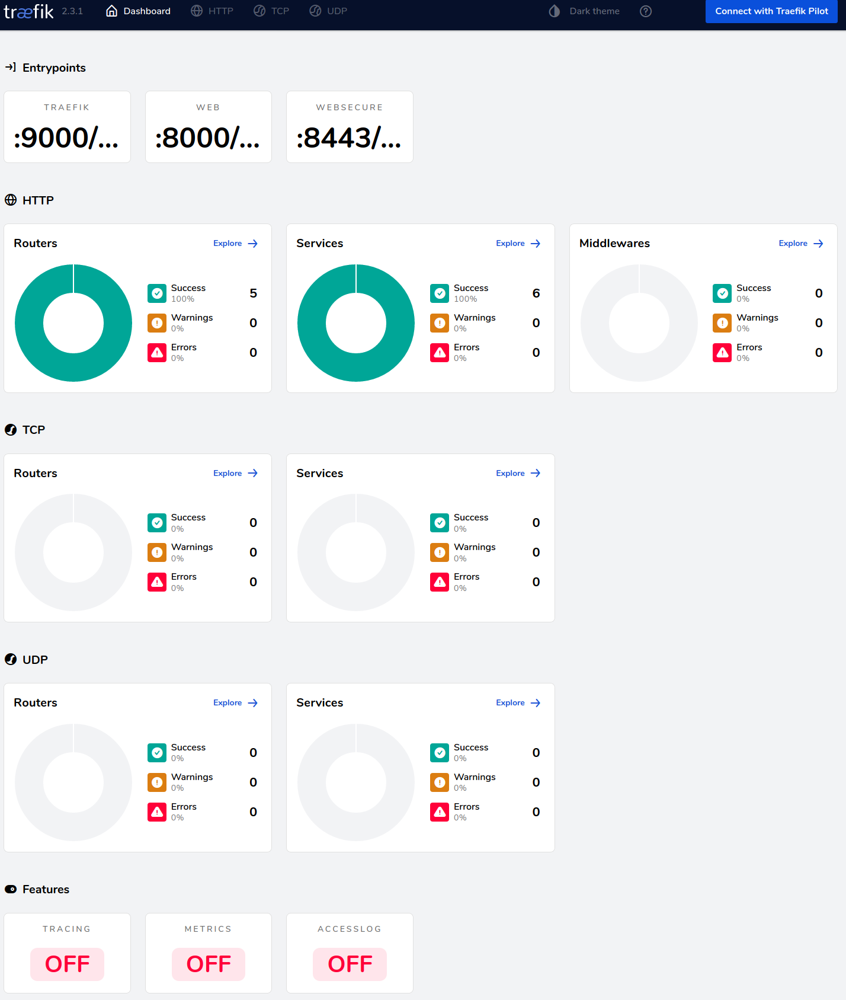

# Traefik Ingress Controller with minikube

Experiment with Traefik locally via minikube.



## Links

* [Traefik enterprise](https://doc.traefik.io/traefik-enterprise/)
* Can be configured by [Consul](https://www.consul.io/)
* stable Traefik [Helm Chart](https://github.com/helm/charts/tree/master/stable/traefik) based on v1.7
* using Traefik [behind an ELB](https://guv.cloud/post/traefik-aws-nlb/)
* Setup Traefik 2.1 [Guide](https://ralph.blog.imixs.com/2020/02/01/kubernetes-setup-traefik-2-1/)
* Traefik 2.2 on [GCE](https://github.com/codeaprendiz/kubernetes-kitchen/tree/master/gcp/task-005-traefik-whoami)

## Installation

Setup minikube with additional resources: `minikube start --cpus 4 --memory 8192`

Install the Traefik Helm chart and deploy the dashboard:

```bash
./install.sh
```

Enable the loadbalander with minikube:

```bash
minikube service list
minikube service traefik
```

Open the URL in your browser, eg. <http://192.168.39.124:32118>.

The dashboard is located (as defined in`dashboard.yaml`) at <http://192.168.39.124:32118/dashboard/> (the last `/`is really important, otherwise you will get a 404).

## Deploy a demo app

In the examples folder there are some demo services.

Deploy the whoami service with:

```bash
kubectl apply -f examples/04-whoami.yaml
```

Access it with: <http://192.168.39.124:32118/whoami/>

The echoserver can be accessed at: <http://192.168.39.124:31570/echoserver>

## WIP: Deploy Prometheus

Deploying Prometheus into minikube works fine. I would like to access the prometheus server at port 80 via a Traefik tngressoute as well.
The creation of the ingressroute works fine, but when accessing the site at `/prometheus` Traefik returns 404. No idea why that is.

```bash
./install-prometheus.yaml
```

Access prometheus with:

```bash
export POD_NAME=$(kubectl get pods --namespace default -l "app=prometheus,component=server" -o jsonpath="{.items[0].metadata.name}")
kubectl --namespace default port-forward $POD_NAME 9090
```

## Deletion

```bash
cd examples
kubectl delete -f .
cd ..
kubectl delete -f dashboard.yaml
helm uninstall traefik
```
